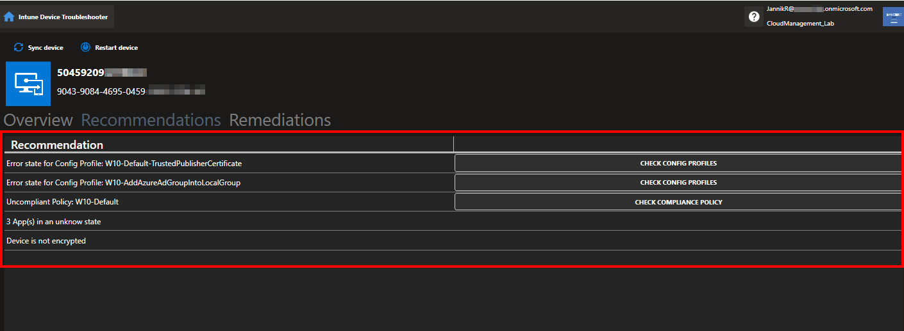

# Intune Device Troubleshooter

<p align="center">
  
</p>

<p align="center">
  <a href="LICENSE">
    
  </a>
  
  
</p>

PowerShell desktop UI for fast, device-level Intune troubleshooting.

It combines managed device data, user context, compliance/configuration status, app deployment states, and remediation actions in one place so you can investigate and act without jumping through multiple admin portals.

## Highlights

- Unified single-device view with Intune + Entra ID context
- Built-in device actions (`Sync`, `Restart`, `Shutdown` when available)
- Actionable recommendations based on current device signals
- One-click remediation trigger for individual devices
- Deep links to Intune admin center and Azure portal from key IDs

## Screenshots

| Device overview | Device actions |
| --- | --- |
|  |  |

| Recommendations | Remediation trigger |
| --- | --- |
|  |  |

## Requirements

- Windows host with PowerShell and WPF support
- Access to Microsoft Intune and Microsoft Graph
- User account with sufficient Intune/Entra admin rights

The tool uses Microsoft Graph `beta` profile.

## Graph Scopes Requested by the Tool

On sign-in, the app requests:

- `User.Read.All`
- `User.Read`
- `Group.Read.All`
- `DeviceManagementManagedDevices.PrivilegedOperations.All`
- `DeviceManagementApps.Read.All`
- `DeviceManagementConfiguration.Read.All`
- `DeviceManagementManagedDevices.Read.All`

If remediation/group operations fail in your tenant, validate additional delegated permissions and role assignments for group write and remediation assignment operations.

## Quick Start

```powershell
git clone https://github.com/JayRHa/Intune-Device-Troubleshooter.git
cd Intune-Device-Troubleshooter
```

Unblock bundled DLLs once (recommended):

```powershell
Get-ChildItem .\libaries\*.dll | Unblock-File
```

Run the app:

```powershell
powershell -ExecutionPolicy Bypass -File .\Start-DeviceTroubleshooter.ps1
```

The script installs `Microsoft.Graph` automatically if it is missing.

## How Remediation Triggering Works

When you start a remediation script for one selected device, the tool:

1. Uses (or creates) a security group named `MDM-Remediation-Trigger-{ScriptName}`
2. Adds the selected device to that group
3. Assigns the remediation script to the group (if not already assigned)
4. Runs the remediation on the next service cycle

The group prefix can be adjusted in `Start-DeviceTroubleshooter.ps1`.

## Notes and Limitations

- Device list is designed for managed `Windows` and `macOS` devices
- Remediation tab is shown for Windows devices
- Some API calls rely on Microsoft Graph `beta` behavior

## Troubleshooting

- Startup fails while loading DLLs: run `Get-ChildItem .\libaries\*.dll | Unblock-File`
- Graph sign-in fails: ensure Microsoft Graph outbound access, allowed consent for scopes, and sufficient Intune/Entra role permissions
- Remediation does not apply: check group creation/member add and verify remediation assignment + device eligibility in Intune

## Author

- Jannik Reinhard
- Website: https://www.jannikreinhard.com
- X/Twitter: https://twitter.com/jannik_reinhard
- LinkedIn: https://www.linkedin.com/in/jannik-r/

## License

MIT. See `LICENSE`.
